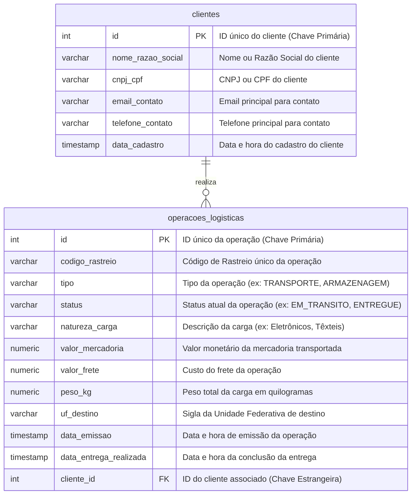

# 🤖 SuppBot - BI

> SUPPBOT BI é uma solução de Business Intelligence conversacional para logística, baseada em IA generativa e RAG (Retrieval-Augmented Generation). O sistema utiliza LLMs para interpretar perguntas em linguagem natural, gerar consultas SQL dinâmicas e entregar respostas precisas e contextualizadas, incluindo gráficos e KPIs. Com arquitetura modular de prompts e memória de conversa, SUPPBOT BI oferece uma interface inteligente para análise avançada de dados logísticos via dashboard e principalmente chatbot.

# 🗂️ Índice
- [🤖 SuppBot - BI](#-suppbot---bi)
- [🗂️ Índice](#️-índice)
- [🛠️ Tecnologias Usadas](#️-tecnologias-usadas)
  - [**Geral**](#geral)
  - [**Frontend**](#frontend)
  - [**Backend**](#backend)
  - [Modelos LLM:](#modelos-llm)
- [🌳 Estrutura do Projeto](#-estrutura-do-projeto)
- [🔄 Updates](#-updates)
- [🧠 Funcionamento](#-funcionamento)
  - [`backend/app/api/dashboard.py`](#backendappapidashboardpy)
  - [`backend/app/chains/sql_rag_chain.py`](#backendappchainssql_rag_chainpy)
  - [`backend/app/core/config.py`](#backendappcoreconfigpy)
  - [`backend/app/core/database.py`](#backendappcoredatabasepy)
  - [`backend/app/core/llm.py`](#backendappcorellmpy)
  - [`backend/app/prompts/sql_prompts.py`](#backendapppromptssql_promptspy)
  - [`frontend/src/components/ChartComponent.js`](#frontendsrccomponentschartcomponentjs)
  - [`frontend/src/components/ChatMessage.js`](#frontendsrccomponentschatmessagejs)
  - [`frontend/src/pages/Chat.js`](#frontendsrcpageschatjs)
  - [`frontend/src/pages/Dashboard.js`](#frontendsrcpagesdashboardjs)
  - [`frontend/src/App.js`](#frontendsrcappjs)
- [🏗️ Estrutura do Banco de Dados](#️-estrutura-do-banco-de-dados)
  - [Diagrama de Entidade-Relacionamento (ERD)](#diagrama-de-entidade-relacionamento-erd)
  - [Detalhamento das Tabelas](#detalhamento-das-tabelas)
    - [Tabela: clientes](#tabela-clientes)
    - [Tabela: operacoes\_logisticas](#tabela-operacoes_logisticas)

---

# 🛠️ Tecnologias Usadas

## **Geral**
- [Node.js](https://nodejs.org/) (**18.3.1**)
- [npm](https://www.npmjs.com/) 
- [Python](https://www.python.org/) (**3.12**)
- [PostgreSQL](https://www.postgresql.org/) 
- [Git](https://git-scm.com/)

---

## **Frontend**
O frontend foi criado com **React** e utiliza:  
- `react-router-dom` (navegação entre páginas)  
- `axios` (requisições HTTP)  
- `recharts` (gráficos e visualizações)  
- `react-icons` (ícones)  
- `uuid` (geração de IDs)  
- `react-scripts` (scripts de build e desenvolvimento)  

---

## **Backend**
O backend foi construído com **FastAPI** + **LangChain**, incluindo:  
- `fastapi` (API backend)  
- `uvicorn` (servidor ASGI)  
- `sqlalchemy` + `psycopg2-binary` (integração com PostgreSQL)  
- `langchain`, `langchain-core`, `langchain-community`, `langchain-groq` (IA e LLMs)  
- `requests` / `httpx` (requisições HTTP)  
- `pydantic` (validação de dados)  
- `faker` (dados de teste)  

## Modelos LLM:
-  `llama-3.3-70b-versatile` - Para geração das queries
-  `llama-3.1-8b-instant` - Para as respostas amigáveis

---

# 🌳 Estrutura do Projeto

```
├── 📁 backend/
│   ├── 📁 app/
│   │   ├── 📁 api/
│   │   │   └── 🐍 dashboard.py
│   │   ├── 📁 chains/
│   │   │   └── 🐍 sql_rag_chain.py
│   │   ├── 📁 core/
│   │   │   ├── 🐍 config.py
│   │   │   ├── 🐍 database.py
│   │   │   └── 🐍 llm.py
│   │   └── 📁 prompts/
│   │       └── 🐍 sql_prompts.py
│   ├── 📁 venv
│   ├── 🔒 .env
│   ├── 🐍 api.py
│   ├── 📄 requirements.txt
│   └── 📄 testes.txt
├── 📁 db_scripts/
│   ├── 🐍 criar_tabelas.py
│   └── 🐍 popular_tabelas.py
├── 📁 frontend/
│   ├── 📁 public/
│   │   ├── 🖼️ favicon.ico
│   │   ├── 🌐 index.html
│   │   ├── 🖼️ logo192.png
│   │   ├── 🖼️ logo512.png
│   │   ├── 📄 manifest.json
│   │   └── 📄 robots.txt
│   ├── 📁 src/
│   │   ├── 📁 components/
│   │   │   ├── 📄 ChartComponent.js
│   │   │   ├── 🎨 ChatMessage.css
│   │   │   ├── 📄 ChatMessage.js
│   │   │   ├── 🎨 Navbar.css
│   │   │   └── 📄 Navbar.js
│   │   ├── 📁 pages/
│   │   │   ├── 🎨 Chat.css
│   │   │   ├── 📄 Chat.js
│   │   │   ├── 🎨 Dashboard.css
│   │   │   └── 📄 Dashboard.js
│   │   ├── 🎨 App.css
│   │   ├── 📄 App.js
│   │   ├── 🎨 index.css
│   │   ├── 📄 index.js
│   │   └── 📄 reportWebVitals.js
│   ├── 📄 package-lock.json
│   └── 📄 package.json
├── 📄 .gitattributes
├── 🚫 .gitignore
└── 📖 README.md
```

# 🔄 Updates

> [!NOTE]
> Versão 1

| Versão | Data       | Mudanças principais               |
|--------|------------|-----------------------------------|
| 1.0    | 25/09/2025 | MVP funcional do SUPPBOT BI       |

---

# 🧠 Funcionamento

Nesta seção, apresentamos uma visão detalhada de como cada parte do SUPPBOT BI opera, do frontend ao backend. Aqui você encontrará uma explicação clara de como os componentes, scripts e módulos interagem entre si, como os dados fluem do usuário até o banco de dados e de volta, e como a inteligência artificial é utilizada para processar perguntas, gerar consultas SQL e exibir respostas e gráficos.  

O objetivo é fornecer ao leitor uma compreensão completa do funcionamento interno do sistema, permitindo não apenas usar o SUPPBOT BI, mas também entender, manter e expandir seu código com facilidade.

---

## [`backend/app/api/dashboard.py`](./backend/app/api/dashboard.py)

> API ROUTER PARA O DASHBOARD Padrões de arquitetura aplicados:
> 1. Connection Pooling: Para reutilizar conexões com o banco de dados e melhorar a performance.
> 2. Cache: Para armazenar em memória os resultados de queries lentas, tornando recargas rápidas.
> 3. Dependency Injection: Padrão do FastAPI para gerenciar recursos (como conexões) de forma segura.

> [!NOTE]
> Para a documentação dos endpoints acesse:
> [ENDPOINTS](ENDPOINTS.md)

---

## [`backend/app/chains/sql_rag_chain.py`](./backend/app/chains/sql_rag_chain.py)

> PROMPT ENGINEERING HUB - O CÉREBRO DA APLICAÇÃO
> 
> Propósito do Arquivo:
> 
> Este arquivo é o centro de controle da inteligência artificial do sistema. Ele centraliza
> todas as instruções (prompts) que definem as "personalidades" e "habilidades" de cada
> componente de IA, garantindo que a lógica conversacional seja clara, manutenível e
> fácil de aprimorar.
>
> Arquitetura e Princípio de Design:
>
> A arquitetura segue o princípio de "Separação de Responsabilidades", onde cada tarefa
> complexa é dividida entre múltiplos "especialistas" de IA que operam em sequência,
> como uma linha de montagem:
> 
> 1. O Porteiro (ROUTER_PROMPT):
> - Responsabilidade: Classificar a intenção do usuário.
> - Ação: Decide se a pergunta é uma conversa casual ou uma consulta ao banco, direcionando-a para o caminho correto.
> 
> 2. O Especialista em Contexto (REPHRASER_PROMPT):
> - Responsabilidade: Resolver ambiguidades e contexto.
> - Ação: Pega perguntas de acompanhamento (ex: "e para ele?") e as reescreve
> como perguntas completas e autônomas, usando o histórico do chat.
> 
> 3. O Engenheiro SQL (SQL_PROMPT):
> - Responsabilidade: Traduzir linguagem natural para SQL.
> - Ação: Recebe a pergunta já clara do Especialista em Contexto e a converte emuma query PostgreSQL precisa, aprendendo com os exemplos fornecidos.
> 
> 4. O Analista de Dados (FINAL_ANSWER_PROMPT):
> - Responsabilidade: Formatar a resposta final para o usuário.
> - Ação: Transforma o resultado bruto do banco de dados em uma resposta amigável,seja em texto ou em um JSON estruturado para gráficos.
> 

> [!NOTE]
> Para a explicação do fluxo acesse:
> [FLUXO](FLUXO_CHAIN.md)


## [`backend/app/core/config.py`](./backend/app/core/config.py)

> ARQUIVO DE CONFIGURAÇÃO CENTRALIZADA (SETTINGS)
>
> Este arquivo funciona como o "painel de controle" da nossa aplicação.
> Ele é responsável por carregar, validar e centralizar todas as 
> configurações externas, como chaves de API e credenciais de banco de dados,
> a partir do arquivo .env.
>
> Usamos a biblioteca Pydantic para garantir que as configurações não apenas
> sejam carregadas, mas também que tenham o tipo de dado correto (texto, número, etc.),
> evitando erros em outras partes do sistema.


## [`backend/app/core/database.py`](./backend/app/core/database.py)

> ARQUIVO DE GERENCIAMENTO DO BANCO DE DADOS
>
> Este módulo centraliza toda a interação com o banco de dados PostgreSQL.
> Ele é responsável por:
> 1. Criar uma instância de conexão que o LangChain pode usar para EXECUTAR queries.
> 2. Gerar uma representação de texto compacta do schema do banco para ser
>    enviada como CONTEXTO para o LLM, evitando erros de requisição muito grande.


## [`backend/app/core/llm.py`](./backend/app/core/llm.py)

> ARQUIVO DE CRIAÇÃO DOS LLMs (FÁBRICA DE MODELOS)
>
> O propósito deste arquivo é centralizar e abstrair a criação das instâncias
> dos modelos de linguagem (LLMs). Ao invés de configurar o ChatGroq em vários
> lugares, criamos funções "fábrica" que retornam um modelo já configurado.


## [`backend/app/prompts/sql_prompts.py`](./backend/app/prompts/sql_prompts.py)

> PROMPT ENGINEERING HUB - O CÉREBRO DA APLICAÇÃO
>
> Propósito do Arquivo:
> 
> Este arquivo é o centro de controle da inteligência artificial do sistema. Ele centraliza
> todas as instruções (prompts) que definem as "personalidades" e "habilidades" de cada
> componente de IA, garantindo que a lógica conversacional seja clara, manutenível e
> fácil de aprimorar.
>
> Arquitetura e Princípio de Design:
>
> A arquitetura segue o princípio de "Separação de Responsabilidades", onde cada tarefa
> complexa é dividida entre múltiplos "especialistas" de IA que operam em sequência,
> como uma linha de montagem:
>
> 1. O Porteiro (`ROUTER_PROMPT`):
>    - Responsabilidade: Classificar a intenção do usuário.
>    - Ação: Decide se a pergunta é uma conversa casual ou uma consulta ao banco,
>      direcionando-a para o caminho correto.
>
> 2. O Especialista em Contexto (`REPHRASER_PROMPT`):
>    - Responsabilidade: Resolver ambiguidades, contexto e correções.
>    - Ação: Analisa a pergunta e o histórico para realizar três ações chave:
>      - **Reescrever** perguntas de acompanhamento (ex: "e o total dele?") em perguntas completas.
>      - **Manter** perguntas que já são claras e autônomas, sem alterá-las.
>      - **Corrigir** a rota ao interpretar reclamações do usuário (ex: "você errou"), reformulando a pergunta anterior com base na nova informação.
>
> 3. O Engenheiro SQL (`SQL_PROMPT`):
>    - Responsabilidade: Traduzir linguagem natural para SQL.
>    - Ação: Recebe a pergunta já clara do Especialista em Contexto e a converte em
>      uma query PostgreSQL precisa, aprendendo com os exemplos fornecidos.
>
> 4. O Analista de Dados (`FINAL_ANSWER_PROMPT`):
>    - Responsabilidade: Formatar a resposta final para o usuário.
>    - Ação: Transforma o resultado bruto do banco de dados em uma resposta amigável,
>      seja em texto ou em um JSON estruturado para gráficos.
>
> Este design modular torna o sistema mais robusto, previsível e fácil de depurar.

## [`frontend/src/components/ChartComponent.js`](./frontend/src/components/ChartComponent.js)

> COMPONENTE DE VISUALIZAÇÃO DE GRÁFICOS
>
> Visão Geral do Componente:
>
> Este arquivo define um componente React reutilizável, `ChartComponent`, responsável por
> renderizar diferentes tipos de gráficos (barras, linhas, pizza) com base nos dados
> fornecidos pelo backend.
>
> Principais Funcionalidades:
>
> 1. Renderização Dinâmica: Utiliza uma estrutura `switch` para escolher qual tipo de
>    gráfico da biblioteca `recharts` será renderizado (`BarChart`, `LineChart`, `PieChart`),
>    com base na propriedade `chart_type` recebida.
>
> 2. Processamento de Dados: Mapeia os dados brutos recebidos do backend para um formato
>    padrão (`{ name, value }`) que a biblioteca `recharts` consegue entender facilmente,
>    tornando o componente flexível a diferentes nomes de campos (`x_axis`, `y_axis`).
>
> 3. Tooltips Personalizados: Implementa componentes de `Tooltip` customizados para
>    melhorar a experiência do usuário, exibindo informações claras e formatadas
>    quando o usuário interage com os gráficos.
>
> 4. Design Responsivo: Usa o `ResponsiveContainer` do `recharts` para garantir que os
>    gráficos se ajustem adequadamente ao tamanho do container onde são inseridos.
>
> 5. Estilização Centralizada: Define paletas de cores e estilos consistentes para
>    todos os gráficos, garantindo uma identidade visual coesa.


## [`frontend/src/components/ChatMessage.js`](./frontend/src/components/ChatMessage.js)

> COMPONENTE DE EXIBIÇÃO DE MENSAGEM DO CHAT
>
> Visão Geral do Componente:
>
> Este arquivo define o componente React `ChatMessage`, que é responsável por renderizar
> uma única mensagem dentro da janela de chat. Ele foi projetado para ser flexível e
> inteligente, adaptando sua aparência e funcionalidade com base no remetente e no tipo
> de conteúdo.
>
> Principais Funcionalidades:
>
> 1. Distinção de Remetente: Aplica estilos e avatares diferentes para mensagens enviadas
>    pelo 'usuário' (`FiUser`) e pelo 'bot' (`FiCpu`).
>
> 2. Renderização de Conteúdo Dinâmico: É capaz de renderizar múltiplos tipos de conteúdo.
>    Se o conteúdo for do tipo 'text', exibe um parágrafo simples. Se for 'chart', renderiza
>    o `ChartComponent` para exibir um gráfico interativo.
>
> 3. Interatividade (Visualizador de Query): Para mensagens do bot que foram geradas a partir
>    de uma consulta ao banco, o componente exibe um botão "Ver Query". Ao ser clicado,
>    ele revela a query SQL exata que foi executada no backend, oferecendo transparência
>    e uma ótima ferramenta de depuração.
>
> 4. Gerenciamento de Estado Local: Utiliza o hook `useState` para controlar a visibilidade
>    do visualizador da query SQL, mantendo o estado de cada mensagem de forma independente.


## [`frontend/src/pages/Chat.js`](./frontend/src/pages/Chat.js)

> COMPONENTE DA PÁGINA PRINCIPAL DE CHAT
>
> Visão Geral do Componente:
>
> Este arquivo define o componente `Chat`, que funciona como o "container" inteligente para
> toda a interface de conversação. Ele é responsável por gerenciar o estado da aplicação,
> lidar com a interação do usuário e orquestrar a comunicação com o backend.
>
> Principais Responsabilidades:
>
> 1. Gerenciamento de Estado (`useState`):
>    - `messages`: Mantém um array com todo o histórico da conversa exibido na tela.
>    - `input`: Controla o valor atual do campo de texto onde o usuário digita.
>    - `isLoading`: Gerencia a exibição do indicador de "carregando" enquanto espera
>      a resposta do backend.
>    - `sessionId`: Armazena o ID único da sessão de chat, garantindo que o backend
>      possa rastrear o contexto da conversa.
>
> 2. Lógica de Ciclo de Vida (`useEffect`):
>    - Na primeira renderização, gera um `sessionId` único que persiste por toda a conversa.
>    - A cada nova mensagem, rola a janela de chat para o final para manter a visibilidade.
>
> 3. Comunicação com a API (`axios`):
>    - No envio da mensagem, formata e envia a pergunta do usuário junto com o `sessionId`
>      para o endpoint `/chat` do backend.
>    - Processa a resposta do backend ou trata possíveis erros de comunicação.
>
> 4. Renderização da UI:
>    - Mapeia o array de `messages` para renderizar uma lista de componentes `ChatMessage`.
>    - Exibe o formulário de entrada de texto e o botão de envio.

## [`frontend/src/pages/Dashboard.js`](./frontend/src/pages/Dashboard.js)

> COMPONENTE DA PÁGINA DO DASHBOARD
>
> Visão Geral do Arquivo:
>
> Este arquivo define a página de Dashboard completa, que exibe visualizações de dados e
> indicadores chave de performance (KPIs) sobre as operações logísticas. A arquitetura
> do arquivo é dividida em quatro partes principais para máxima reutilização e clareza:
>
> 1. useDataFetching (Hook Customizado):
>    - Um hook React reutilizável que encapsula toda a lógica de busca de dados da API.
>    - Gerencia os estados de carregamento (loading), erro e os dados recebidos.
>    - Implementa um mecanismo de "polling" que atualiza os dados automaticamente a cada
>      15 segundos, criando um dashboard "ao vivo".
>
> 2. KpiGrid (Componente de Apresentação):
>    - Um componente dedicado a buscar e exibir a grade de KPIs no topo da página.
>
> 3. ChartWrapper (Componente Container/Wrapper):
>    - Um invólucro genérico para cada gráfico. Ele utiliza o hook `useDataFetching` para
>      buscar os dados do gráfico e lida com a exibição dos estados de carregamento,
>      erro ou dados vazios. Isso mantém o componente principal do Dashboard limpo.
>
> 4. Dashboard (Componente Principal da Página):
>    - Monta o layout completo da página, incluindo o cabeçalho, a grade de KPIs e
>      múltiplas instâncias do `ChartWrapper` para renderizar cada gráfico específico.

## [`frontend/src/App.js`](./frontend/src/App.js)

> COMPONENTE RAIZ E ROTEADOR DA APLICAÇÃO
>
> Visão Geral do Componente:
>
> Este arquivo define o componente `App`, que serve como o ponto de entrada e o componente
> de mais alto nível para toda a aplicação React. Sua principal responsabilidade é definir
> a estrutura de layout geral e gerenciar o sistema de roteamento de páginas.
>
> Principais Funcionalidades:
>
> 1. Configuração do Roteador: Utiliza o `react-router-dom` para habilitar a navegação
>    entre diferentes "páginas" (componentes) da aplicação sem a necessidade de recarregar
>    a página inteira, criando uma experiência de Single-Page Application (SPA).
>
> 2. Layout Persistente: Renderiza componentes comuns que devem aparecer em todas as
>    páginas, como a barra de navegação (`Navbar`), garantindo uma interface consistente.
>
> 3. Mapeamento de Rotas: Define quais componentes de página (`Dashboard`, `Chat`) devem
>    ser renderizados com base na URL atual do navegador. Por exemplo, a URL "/" renderiza
>    o Dashboard, enquanto "/chat" renderiza a página de Chat.


# 🏗️ Estrutura do Banco de Dados

Esta seção detalha o esquema do banco de dados PostgreSQL utilizado para os testes e demonstrações do **SUPPBOT BI**. O modelo foi projetado para simular um ambiente de logística real, com tabelas para clientes e suas respectivas operações.

## Diagrama de Entidade-Relacionamento (ERD)

> O diagrama abaixo ilustra as tabelas principais e o relacionamento entre elas. A relação fundamental é que um cliente pode ter múltiplas operações logísticas.



## Detalhamento das Tabelas

### Tabela: clientes

> Armazena as informações cadastrais de cada cliente.

| Coluna             | Tipo de Dado         | Descrição                                                      |
|--------------------|----------------------|----------------------------------------------------------------|
| id                 | SERIAL PRIMARY KEY   | Identificador único e sequencial para cada cliente.             |
| nome_razao_social  | VARCHAR(255)         | Nome completo ou Razão Social do cliente.                       |
| cnpj_cpf           | VARCHAR(20)          | CNPJ (para empresas) ou CPF (para pessoas físicas).             |
| email_contato      | VARCHAR(255)         | Endereço de e-mail principal para contato.                      |
| telefone_contato   | VARCHAR(20)          | Número de telefone para contato.                                |
| data_cadastro      | TIMESTAMP            | Data e hora em que o cliente foi cadastrado.                    |

---

### Tabela: operacoes_logisticas

> Registra cada operação logística realizada, contendo todos os seus detalhes e status.

| Coluna                | Tipo de Dado        | Descrição                                                                 |
|-----------------------|---------------------|---------------------------------------------------------------------------|
| id                    | SERIAL PRIMARY KEY  | Identificador único para cada operação.                                   |
| codigo_rastreio       | VARCHAR(50)         | Código alfanumérico usado para rastrear a operação.                       |
| tipo                  | VARCHAR(50)         | Define o tipo da operação (ex: 'TRANSPORTE', 'ARMAZENAGEM').              |
| status                | VARCHAR(50)         | O estado atual da operação (ex: 'SOLICITADO', 'EM_TRANSITO', 'ENTREGUE'). |
| natureza_carga        | VARCHAR(100)        | Descreve o tipo de mercadoria (ex: 'Alimentos', 'Eletrônicos').           |
| valor_mercadoria      | NUMERIC(12, 2)      | O valor declarado da mercadoria.                                          |
| valor_frete           | NUMERIC(10, 2)      | O custo do serviço de frete.                                              |
| peso_kg               | NUMERIC(10, 2)      | O peso total da carga em quilogramas.                                     |
| uf_destino            | VARCHAR(2)          | A sigla do estado de destino da operação.                                 |
| data_emissao          | TIMESTAMP           | Data e hora em que a operação foi criada no sistema.                      |
| data_entrega_realizada| TIMESTAMP           | Data e hora em que a entrega foi oficialmente concluída (pode ser nulo).  |
| cliente_id            | INTEGER             | Chave estrangeira que referencia a coluna id da tabela clientes.          |
